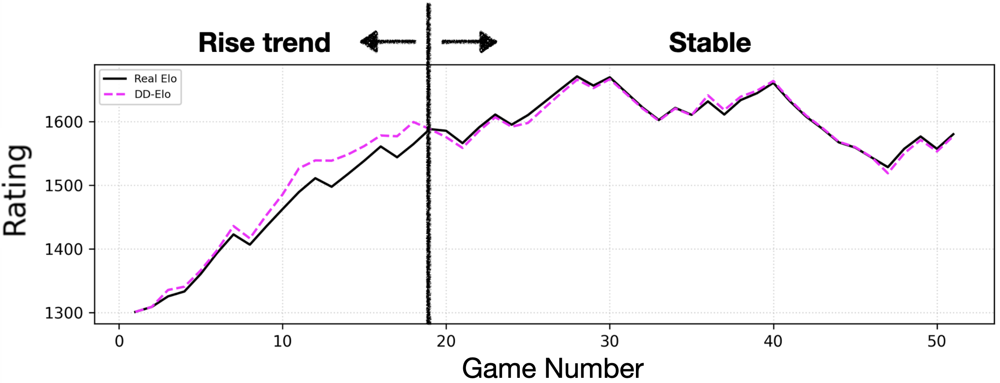
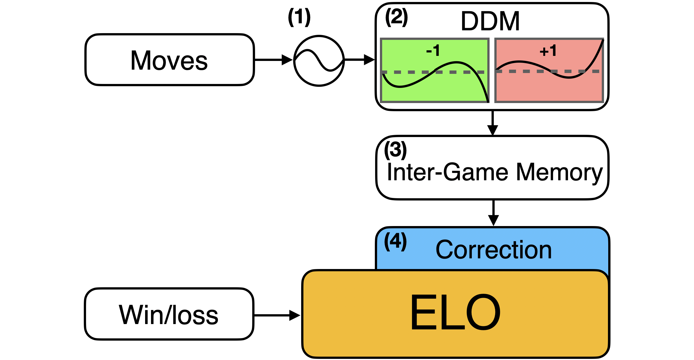

# Accelerating Skill Assessment in Chess: A Drift-Diffusion-Enhanced Elo Rating System

This repository contains the official implementation of the paper:
**"Accelerating Skill Assessment in Chess: A Drift-Diffusion-Enhanced Elo Rating System"** (Accepted by **IEEE Conference on Games (CoG) 2026**).

<p align="center">
  
  
</p>

<p align="center">
  <b>Figure: Performance Showcase (Left) & Algorithm Structure (Right)</b>
</p>


## 🚀 Quick Start (Reproduce All Results & Figures)

To make it as easy as possible to verify our work, we provide pre-computed player dictionaries, caches, and intermediate data hosted on **Hugging Face Datasets**. Follow these steps to reproduce all the experimental results and figures (AI, DA, IC, LeadTime) reported in the paper within minutes.

### 1. Clone the Repository & Install Dependencies
```bash
git clone https://github.com/Aquila-zhou1/DD-Elo.git
cd DD-Elo
pip install -r requirements.txt
```
### 2. Download Pre-computed Data & Cache
Run our helper script to fetch the processed datasets and cached dictionaries directly into the data/ directory:

```Bash
python scripts/download_data.py
```
### 3. Run Experiments & Visualization (Cache Mode)
Execute the main pipeline with the --cache flag. This will load the pre-computed player structures, instantly evaluate all core metrics, and generate the corresponding paper figures:

```Bash
python main.py --cache
```
📊 Note: All numerical results, statistical metrics, and visualization charts will be saved directly into the data_analysis/ directory.

## 🛠️ End-to-End Verification From Scratch
If you wish to verify the full dataset construction pipeline starting entirely from the raw chess move-level dataset, use the standard mode execution.

### 1. Place the Raw Dataset
Download the original move-level dataset from the [Toronto CSSLab Chess Data](http://csslab.cs.toronto.edu/data/chess/monthly/lichess_db_standard_rated_2019-01.csv.bz2) and place it under the following path:

`data/raw/lichess_db_standard_rated_2019-01.csv`

### 2. Run Full Pipeline
Run the main entry script without the cache flag. This will parse the move-level logs, process game-level variables, construct the player index tree, and sequentially compute all assessment dynamics:

```Bash
python main.py
cd src
python AI_DA_IC.py --cache
python LeadTime.py --cache
python StandardIC.py --cache
```
(Note: Executing the full training pipeline from scratch might take several hours depending on your hardware specifications).

## 📂 Repository Structure
```Plaintext
.
├── data/                       # Dataset directory (managed via Hugging Face Hub, git-ignored)
│   ├── raw/                    # Raw move-level chess logs
│   ├── processed/              # Parsed game-level data
│   └── cache/                  # Serialized player objects and matrices (.pkl)
├── src/                        # Core algorithmic modules
│   ├── ddm_elo.py              # Implementation of the core DD-Elo framework
│   ├── elo_per_game.py         # Standard Elo baseline calculation per game
│   ├── AI_DA_IC.py             # Accuracy/Consistency indicators (Cache mode)
│   ├── LeadTime.py             # Average Lead-Time metrics (Cache mode)
│   └── StandardIC.py           # Standard IC evaluation suite (Cache mode)
├── scripts/
│   └── download_data.py        # Automated download utility for HF dataset mirrors
├── data_analysis/              # Output directory for evaluation results, tables, and plots
├── main.py                     # Unified entrance file (Handles metrics calculation & visualization)
├── requirements.txt            # Environment configurations
└── README.md                   # Project documentation
```
## ✍️ Citation
If you find our code, dataset, or research framework useful for your work, please cite our paper.
